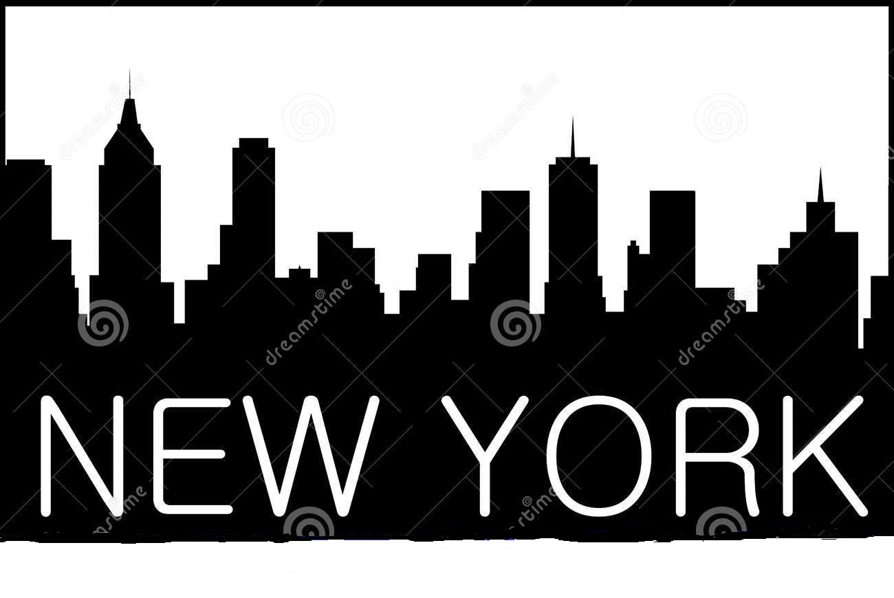
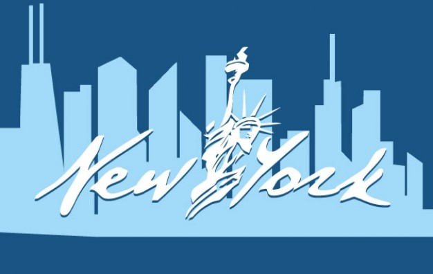

<!DOCTYPE html>
<html>
<title>NYC Department of Administrative Serveices</title>
<meta name="Description" content="Civil Open Data for NYC DECAS">
<body>
<head>   
    
<h1>NYC Department of Administrative Services</h1>

The Department of Administrative services is the city agency in New York City that is reponsible to ensure there is fair play when applying for jobs in all the City agencies by eligible candidate of New Yorkers that live in all the five boroughs of New York City. They conduct computerised Civil Service exams and placed the names of successful candidates City agencies that will hire them  on waiting list until it is time for the candidates to be called for interview in  all the City agencies in New York City.

<button>Click Here to Book an Appointment</button>

The Department of Citywide Administrative Services can be reached at the website below.

<a href="http://www.nyc.gov/html/dcas/html/home/home.shtml">NYC Department of Adminstrative Services</a>

</body>
</html>

